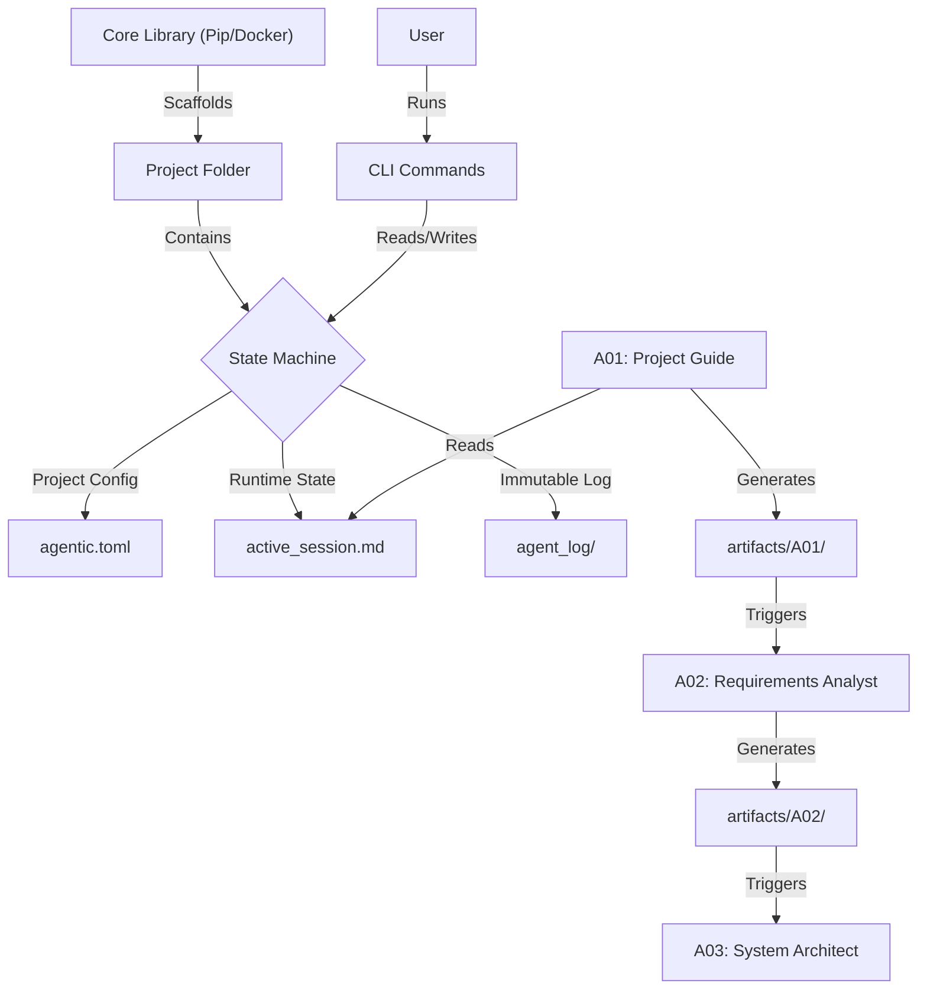

# Agentic Workstation

> **Structured Architectural Scaffolding for AI Development**

[](https://github.com/sujith-eag/agentic-workstation)
[](LICENSE)
[](pkgs/container/agentic)

**Agentic Workstation** is a development platform that orchestrates Multi-Agent Systems to plan, architect, and implement complex software projects. Unlike "Chat with Code" tools that rely on messy, unstructured conversation history, this system enforces a **Context-First** philosophy. It treats Agent Context as a file-system state machine, ensuring that your AI Engineer knows exactly what your AI Architect decided.

---

## ⚡ Why Use This?

Most AI coding tools suffer from **Context Drift**. After 20 messages, the AI forgets the architectural constraints you set in message #1.

AI for projects and work is like a rocket: it gives a quick boost of velocity if you have direction, but soon everyone realizes it's only a first-stage booster that stops midway once context is off. The velocity drops, and to carry forward and build production-grade applications needs a 2nd and 3rd stage booster with precision guidance to reach and stay in orbit. **This project is that 2nd and 3rd stage.**

**Agentic Workstation solves this by:**
1.  **Strict Role Separation:** "Architects" write specs. "Engineers" write code. They never swap roles.
2.  **Artifact-Driven Handoffs:** An agent cannot proceed until it receives a specific, validated artifact (e.g., `api_spec.md`) from its predecessor.
3.  **No "Chatting":** You don't chat in the terminal. The system generates a comprehensive **Context File** that you drop into your preferred AI (ChatGPT, Claude, Gemini, VS Code Copilot). The AI does the work, and you save the result. The system tracks the state.

---


## CLI Usage

For detailed CLI documentation, see [CLI_REFERENCE.md](docs/CLI_REFERENCE.md).

### Quick Start

```bash
# Install
pip install agentic-workstation

# Initialize project
agentic project init my_project

# Start workflow
agentic workflow init my_project

# Activate first agent
agentic workflow activate my_project A01
```

### Available Commands

- `agentic project` - Project management (init, list, remove, status)
- `agentic workflow` - Workflow orchestration (init, activate, handoff, status)
- `agentic --help` - Show all available options

## 🏗️ Architecture

The system operates on a **Stateless Core / Stateful Edge** model.



---

## 🚀 Quick Start

### Environment Setup
Create and activate a Python virtual environment:
```bash
# Create virtual environment
python3 -m venv myproject-env

# Activate the environment
source myproject-env/bin/activate  

# On Windows: 
source myproject-env\Scripts\activate
```

### Installation

**Option A: Pip (Recommended)**
```bash
pip install agentic-workstation

# Verify installation
agentic --version
agentic workflow list
```

**Option B: From Source (Development)**
```bash
git clone https://github.com/sujith-eag/agentic-workstation.git
cd agentic-workstation
pip install -e .
```

### Uninstallation

**Option A: Pip**
```bash
pip uninstall agentic-workstation
```

**Option B: Docker**
```bash
# Remove the Docker image
docker rmi agentic-workstation

# Remove any running containers (if any)
docker rm $(docker ps -aq --filter ancestor=agentic-workstation)
```

### 1. Initialize a Project
Navigate to your empty folder and initialize a project.
```bash
mkdir my-new-saas && cd my-new-saas
agentic project init MySaaS
```
*This creates a project with the default "planning" workflow. Use `--workflow` to specify another workflow.*

### 2. The "Active Session" Loop
The system creates an `active_session.md` file. This is your interface with the AI.
1.  **Activate:** `agentic workflow activate A-01` (Project Guide).
2.  **Generate:** Copy the content of `active_session.md` into your LLM (Claude/GPT-4).
3.  **Save:** Paste the LLM's output into the requested file (e.g., `artifacts/A-01/project_brief.md`).
4.  **Handoff:** Tell the system you are done.
    ```bash
    agentic workflow handoff --to A-02 --artifacts artifacts/A-01/project_brief.md
    ```
    *The system validates that the file exists before allowing the handoff.*

### 3. Review Status
View the decision tree and current state.
```bash
agentic workflow status
```

---

## 📦 Workflows (NOT ENTIRLY COVERED YET)

The system supports pluggable **Workflow Manifests**.

### 1. Planning (Canonical)
*   **Goal:** Turn a 1-sentence idea into a full Tech Spec.
*   **Agents:**
    *   `A-01 Incubation`: Refines the idea.
    *   `A-02 Requirements`: Lists functional/non-functional reqs.
    *   `A-03 Architect`: Designs the system topology.
    *   `A-04 Security`: Threat modeling.
    *   (And 10 more specialized roles).

### 2. Implementation (Canonical)
*   **Goal:** Turn specs into code.
*   **Agents:**
    *   `E-01 Frontend`: React/Vue/Svelte implementation.
    *   `E-02 Backend`: API & Logic.
    *   `E-03 Database`: Schema & Migrations.

### 3. Custom Workflows
You can create your own workflows by placing a manifest in:
- Project: `./.agentic/workflows/my-custom-flow/workflow.json`
- User global: `~/.config/agentic/workflows/my-custom-flow/workflow.json`
- System: Bundled in package (not recommended for custom)

Workflow manifests include `workflow.json`, `agents.json`, `artifacts.json`, etc.

---

## 🛠️ CLI Commands

### Global Commands
```bash
# List available workflows
agentic workflow list

# List all projects
agentic project list

# Show CLI help
agentic --help
```

### Project Commands
```bash
# Create new project
agentic project init MyProject --workflow planning --description "My project description"

# Show project status
agentic project status

# List projects
agentic project list
```

### Workflow Commands (within project)
```bash
# Initialize workflow session
agentic workflow init planning

# Show workflow status
agentic workflow status

# Activate an agent
agentic workflow activate A01

# Record handoff between agents
agentic workflow handoff --from A01 --to A02 --artifacts "file1.md,file2.pdf"

# Record decisions
agentic workflow decision --title "Decision title" --rationale "Reasoning"

# End workflow
agentic workflow end
```

### Project-Specific Usage
Each project includes a `workflow` script for convenient access:
```bash
cd projects/MyProject
./workflow status          # Project status
./workflow activate A01    # Activate agent
./workflow handoff --from A01 --to A02 --artifacts file.md
```

## ⚙️ Configuration & Governance

### `agentic.toml`
Every project handles its own configuration.
```toml
[project]
name = "MySaaS"
version = "0.1.0"

[governance]
require_reviews = true
git_commit_on_handoff = true
```

### Global Config (`~/.config/agentic/config.toml`)
Set your preferences for all projects.
```toml
[directories]
projects = "projects"

[governance]
level = "moderate"

[workflows]
default = "planning"
```

---

## 🛠️ Development

This project is built with Python 3.10+.

*   **Core:** `src/agentic_workflow`
*   **Manifests:** `src/agentic_workflow/manifests` (Canonical Definitions)
*   **Templates:** `src/agentic_workflow/templates` (Jinja2 templates)
*   **Build:** `pyproject.toml` (Hatchling)
*   **Tests:** Not included in deployment

**License:** MIT
