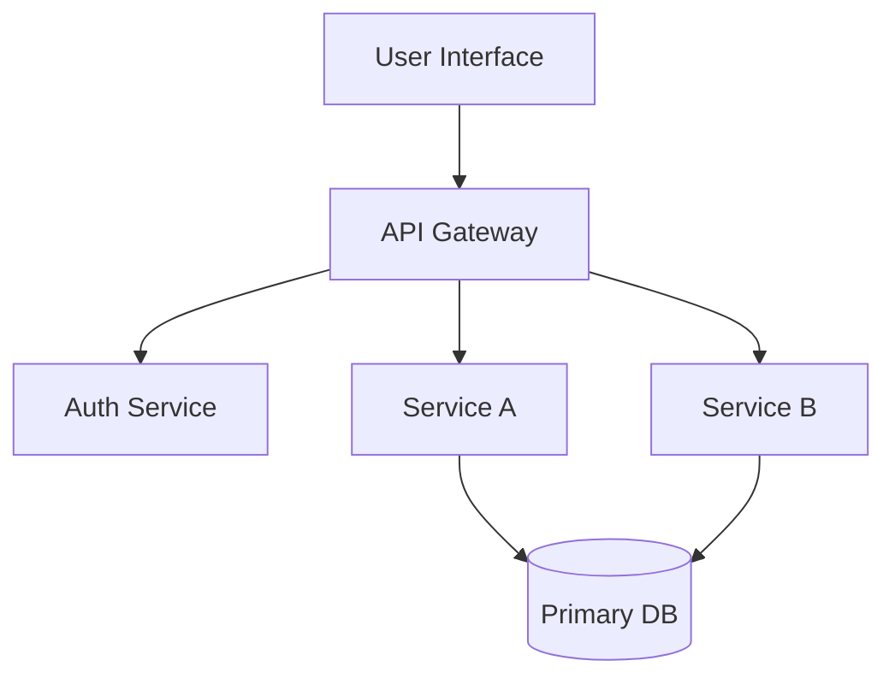

```yaml
# architecture_overview.md.j2
# Template front-matter: replace placeholders
title: "Architecture Overview: {{project_name}}"
authors:
  - "{{author_name}}"
date: "{{date}}"
version: "0.1.0"
governance:
  traceability_updates: true
  adr_required_on_change: true
  last_writer_agent: 2
  iteration_cycle: BASE
---

# Architecture Overview: {{project_name}}

Purpose: High-level description of system architecture and component responsibilities.

Required Inputs:
- `project_overview.md`
- `requirements_spec.md`
- `data_strategy.md`
- `exchange_log.md` (Check for upstream HANDOFF)

Optional Inputs (if available / post-correlation):
- `logical_data_model.md`
- `integration_consistency_audit.md` (Agent 13)
- `implementation_feasibility_gap_report.md` (Agent 13)
- `secure_design_recommendations.md`

Outputs:
- `system_design.md` (detailed components)
- `component_diagrams.md`
- `data_flow_overview.md`

## Gating Check
- [ ] Confirmed upstream HANDOFF entry in `exchange_log.md`.
- [ ] No OPEN CRITICAL/HIGH feedback tickets in `exchange_log.md`.

## System Overview
Describe major components and their responsibilities; list each with a brief responsibility sentence.

Traceability Summary (placeholder):
| component | primary_req_ids | key_data_entities | critical_endpoints |
|-----------|-----------------|-------------------|--------------------|
| ComponentA | REQ-001, REQ-004 | EntityX | GET /v1/x |
| ComponentB | REQ-002 | EntityY | POST /v1/y |

## Component Diagram
Include a simple mermaid diagram; adapt as needed. Ensure naming aligns with `integration_consistency_audit.md` (if run) and data entities used.



## Data Flows
- Describe important data flows and trust boundaries.
- Highlight transformations referencing entities in `logical_data_model.md`.
- Note any pending IFIA-GAP references (e.g., GAP-REF: IFIA-GAP-003) for unresolved mapping issues.

## Non-functional Considerations
- Scalability (capacity alignment)
- Security (controls referencing `secure_design_recommendations.md`)
- Observability (baseline metrics & traces planned)
- Resilience (fallback paths, redundancy)
- Performance (latency-sensitive components)
- Accessibility impact (if UI layer architectural decisions influence flows)

## Open Questions & Assumptions
- Outstanding architectural questions requiring ADR or further feasibility review.
- Assumptions pending validation (origin: requirement / ADR / feedback).
- List any IFIA-ASSUMP references if Agent 13 feasibility audit created provisional assumptions.

## Links & ADRs
- ADRs influencing design (list)
- Traceability rows updated (REQ-IDs) and version changes.
- Feasibility / Integration References: link to `integration_consistency_audit.md` mismatches addressed; link to `implementation_feasibility_gap_report.md` items closed or pending.

## Post-Validation Hooks
Outline follow-up actions:
- If integration audit reveals contract mismatches → schedule refinement.
- If gap report lists Blocker items → escalate before finalizing architecture.
- Confirm logic coverage alignment for domain-heavy components (refer `logic_completeness_review.md`).

```